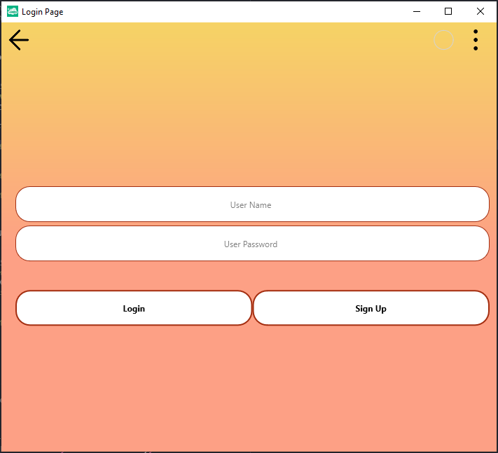

# SQLite Login & SignUp UI

This project is a **Login** and **SignUp** application developed using the Clomosy platform. User information is stored locally in an **SQLite database**. The project aims to demonstrate basic user authentication operations for developers.

## Features

- User registration (`Sign Up`)
- User login (`Login`)
- Local data storage with SQLite
- Automatic table creation (if it doesn't exist)
- Predefined sample users (ömer / 123456, leyla / 456789)

