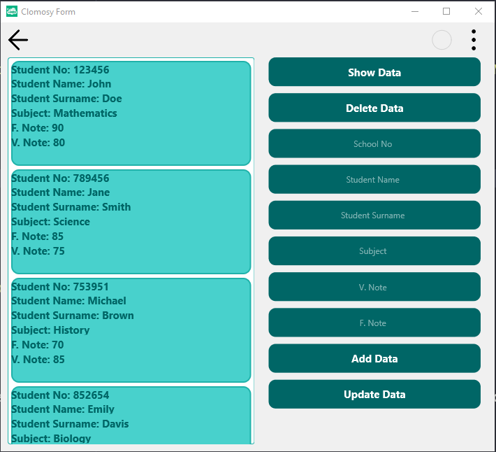

# Student Exam Information Management System

### Description
The application connects to an SQLite database to store and manage student information. The user interface includes a ListView and various editing components. Operations such as adding, deleting, updating, and listing students can be performed. The data includes fields such as student number, first name, last name, course, midterm, and final grades. Dynamic component properties and event handlers have been used to provide a user-friendly interface. Database connection, table creation, and sample data insertion operations are also implemented within the application.

### Usage
* The project is pasted into the "Main Code" screen, saved, and then executed.
* The left side of the screen displays a list of data retrieved from the database.
* Clicking the "Show Data" button retrieves and lists student exam information from the database.
* Clicking the "Delete Data" button deletes the selected item from the list. If no data is selected from the list and the TclEdit fields are empty, the user will receive a warning, and no deletion will occur.
* When the "Add Data" button is clicked, if the fields in the TclEdit components are filled, the data will be added to the database.
* When an item's data is updated and the "Update Data" button is clicked, the item's data in the database is updated. Similarly, if no item is selected, no update will be performed.

