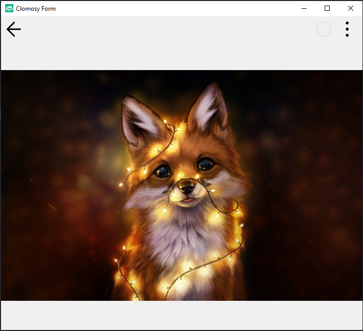

# Form - Adding an Image

### Description
A TclForm object is created, and a TclImage object is added to it. The added image is set to cover the entire form (alClient), and its height is set to 100 pixels. The image is loaded using the SetImage method from the specified URL to be displayed on the form. Finally, the form is executed using the Run method. This process allows the image, which is a visual element, to be displayed on the screen.

### Usage	
* The project is pasted into the "Main Code" screen, saved, and when executed, the result is obtained.

