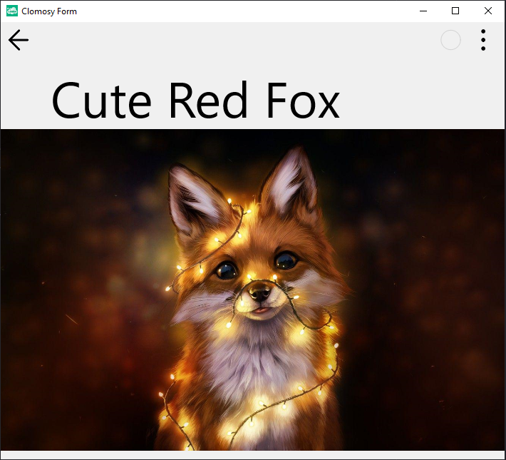

# Image Click and Label Usage

### Description
In the above code, a TclForm object is created, and a TclImage and a TclLabel are added to it. The TclImage object is configured to cover the entire form with an image loaded from the specified URL, and its height is set to 100 pixels. An event is added so that when the image is clicked, the message "Grrrr!" is displayed. Then, a TclLabel is added, displaying the text "Cute Red Fox" at the top of the form. The font size of the label is set to 70 pixels, and it is aligned to the top of the form. Finally, the form is executed using the Run method, which displays the image and label on the screen.

### Usage
* The project is pasted into the "Main Code" screen, saved, and then executed.
* When the image in the application is clicked, the written message is displayed on the screen.

