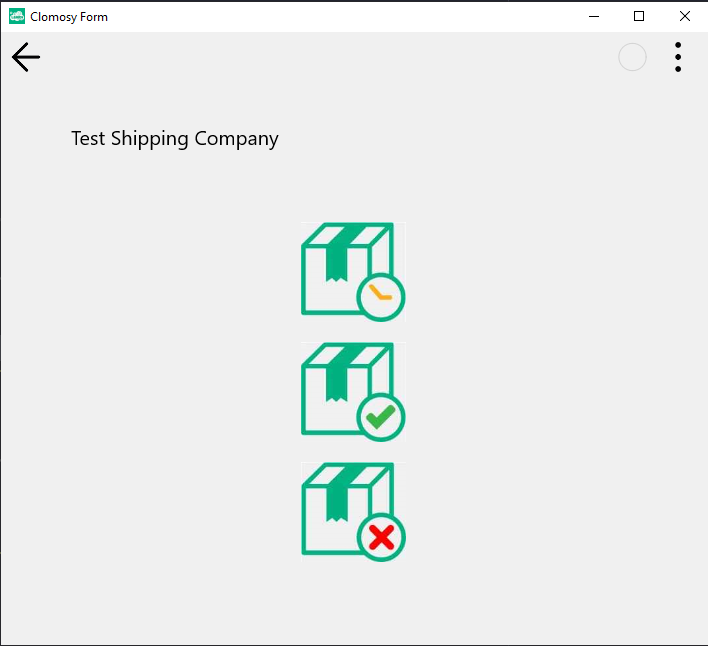

# Navigation Actions via Image Clicks

### Description
The purpose of this project is to create a user interface for a shipping company application and simulate user interactions. The application includes visual buttons for three different actions: Pending Shipment, Shipment Confirmation, and Shipment Rejection.

Users can select one of these actions by clicking the corresponding visual buttons, and an informational message is displayed on the screen after each action. This structure is designed to enhance the user experience by visualizing the operations and providing a more intuitive interface.

The project also serves as an example of how to handle user actions via click events and demonstrates the placement of elements on a dynamic form.

### Usage
* After the project is pasted into the "Main Code" screen, it is saved and executed.
* When the visuals in the application are clicked, the written message is displayed on the screen.

