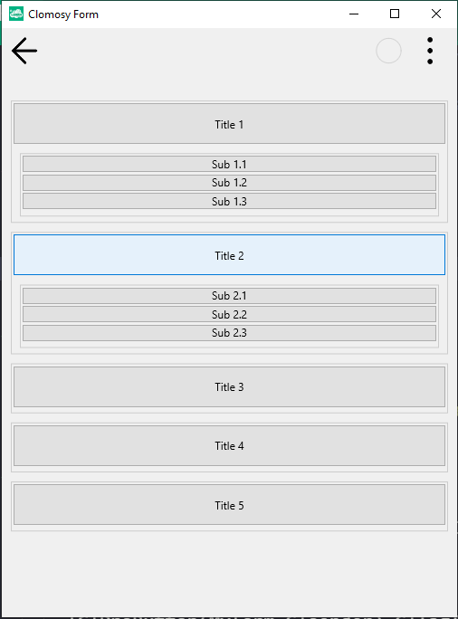

# Expandable Button List

This project is an example of a list structure consisting of buttons that open and close upon clicking. Under each header, sub-buttons can be revealed or hidden by clicking the header button. This project is a useful example for those who want to create and manage dynamic button lists.

**NOTE:** Don't forget to add the `uAddComponent` unit to your project. Otherwise, it will cause an error.

## Features

- Main header buttons are clickable.
- Under each main header, there are sub-buttons. These sub-buttons become visible when the corresponding header button is clicked.
- The buttons under each header are displayed and hidden in relation to their respective header.

