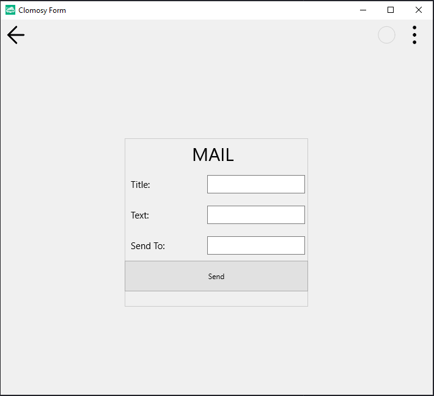

# Sending Mail with User Input

### Description
This project aims to develop an application that provides email sending functionality to users. The application includes edit fields for entering information such as the subject, text, and recipient address, along with a "Send" button. After filling out these fields, the user clicks the "Send" button to send the email. The email is sent via the Clomosy platform, including the subject, content, and recipient address. The project demonstrates how user interface components are dynamically created and how click events are handled.

### Usage
* The project is pasted into the "Main Code" screen, saved, and executed.
* The "Title," "Text," and "Send To" fields in the application must be filled out.
* After all fields are correctly filled, the "Send" button is clicked to send the email.

