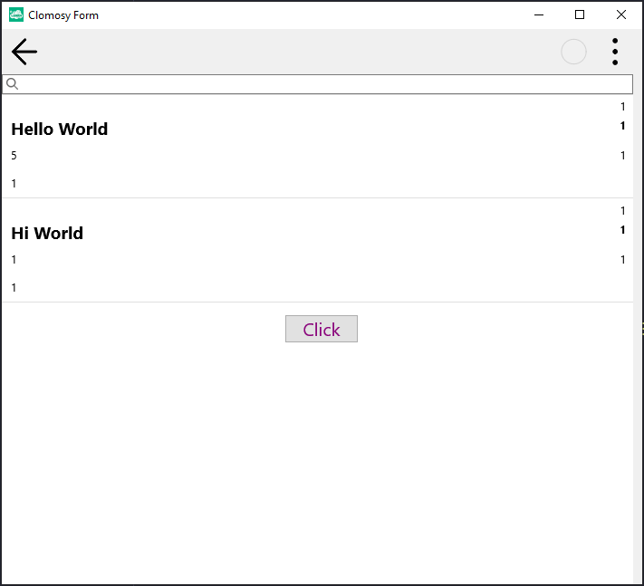

# Using CheckBox List in a ListView Object

### Description
This project loads JSON-formatted data into a list view component and allows users to make selections from the list. When an onClick event is triggered for each item, it displays the selected items and their text in a message box. It also includes a function that shows the count of selected items. This project demonstrates dynamic listing, data loading, handling user interactions, and displaying data in a formatted way.

### Usage
* The project is pasted into the "Main Code" screen, saved, and run.
* The application contains a list. When items in the list are clicked, they become selected.
* If the "Click" button at the bottom of the page is clicked, the selected list items are displayed in a message box.

