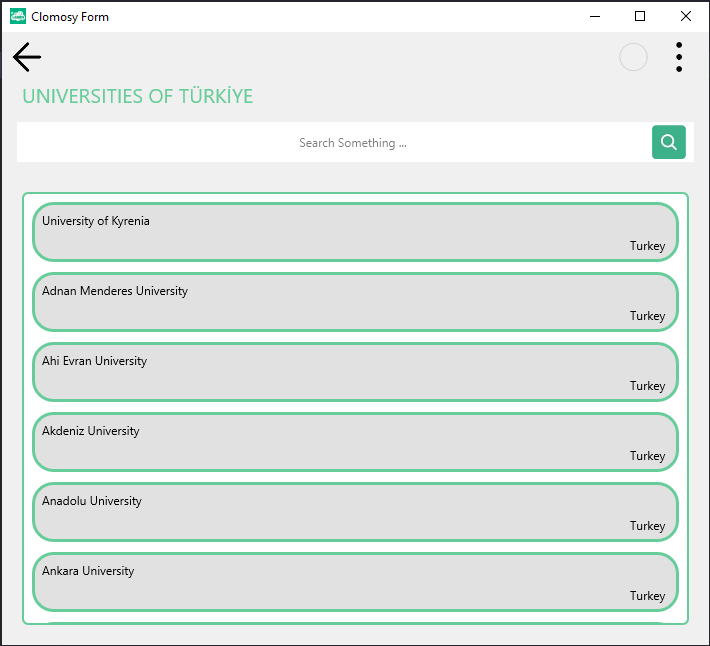

# Web API Usage

### Description
This project aims to develop an application that lists universities in Turkey. The application displays data retrieved from an API in a dynamic list view, including each university's name, website, and country information. Users can click on any university in the list to open its website in a browser panel. Additionally, the application includes a search field, allowing users to easily find a specific university. The project demonstrates processes such as fetching data from an API, dynamically creating user interface components, and managing data interactions.

### Usage
* The project is saved and executed after pasting into the "Main Code" screen.
* A specific university can be searched by typing its name into the search box located at the top of the list in the application.
* To navigate to the website of a listed university, click on the desired university name.
When a university is clicked, the relevant website opens within a panel.
* To close the panel, simply click the close button (X) located at the top right corner.

Proje videosuna erişmek için [buraya tıklayabilirsiniz.](https://www.docs.clomosy.com/images/e/ea/TclHttpExample.mp4)
